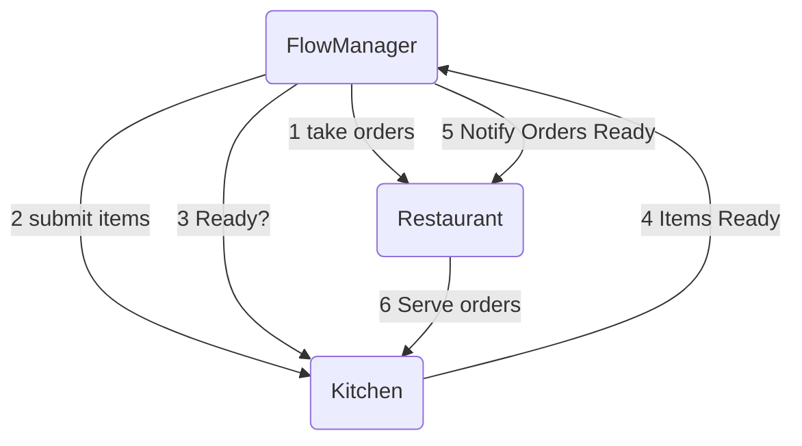

# Diner Emulator

## Responsiblities

Emulator
- maintain collaboration between Flow Manager, Kitchen and Restaurant
- Generate Order flow for Restaurant
- Monitor state from Flow Manager
- Present results / satisfaction / comments

Flow Manager
- Generate work flow for kitchen
- Adjust state in response to issues
- Deliver completed orders to Restaurant

Restaurant
- Generate orders on request from Emulator
- Deliver orders
- Retrieve Diner Satisfaction/comments

## Flow

## Use cases

Restaurant (Front-of-house) process
- A Table hold one or more Diners;
- Each Diner places an Order with a Server;
- The Order consists of an Item with Sides selected from a Menu;
- The Server submits Orders to the Flow Manager, one Table at a time;
- When the Order has been filled by the Kitchen, the Flow manager alerts the restaurant
- The Server delivers to one Table at a time.
- Diner satisfaction is recorded.

Kitchen (Back-of-house) process
- The Flow Manager gives a copy of each Order to the Kitchen;
- The Chefs perform a sequence of Tasks to prepare the Items requested;
- When all the Items for one Order are ready, the Flow Manager knows that the order is Filled;
- The Server for that Table delivers the Items to the Diners.

Notes:
- All requested Items are prepared by referencing the Menu, which does not change often;
- Each Task may have necessary requirements which might not be met: in such case there may be contingent tasks (e.g. ran out of chicken, need to thaw some more);
- If a Task fails, it might require simple adjustment, or redo of one task, or the entire process might be restarted;
- A Task might be impossible (e.g. ran out of meat, so no steak tonight);

Diners vacate the Table after a finite time, and new diners will be seated, so the flow continues.

## Emulation

Emulator generates random orders, based on a menu
Flow manager initiates preparation of all the items for the order
Errors are injected into some items as part of the simulation
Kitchen is requested to make the items
Flow manager checks with the kitchen for correct item completion
Flow manager may take additional steps to overcome errors
(Refire, retry, ask for new order...)
Flow manager offers completed items to the restaurant
Diner satisfaction will depend on
- Whether they git their order
- Whether it was complete
- Whether it was on time

The emulator should be able to inject different levels of error (from retry/delay to catastrophic)
Each order/item can be time tracked, and incoming orders compared with outgoing orders, to know what is in flight at ant time, what is proceeding normally, what is pending resolution and what has failed.
We should be able to visualize these somehow as the emulator is run, anf compare different levels of entropy.

## Implementation strategy

We have four (or five) components
- KitchenService    prepares items 
- RestaurantService orders and accepts completed items
- FlowManager       manages the process
- (ModelTester)     tests the model through a console
- Emulator          tests the model through a web interface

The hidden part of this is a data source to manage the flows.

To start out, we need to define the simplest possible models

Then we arrange to be able to store state of orders in flight (requested orders might be a subset?)

Then we need to be able to 
- send an order to the restaurant from the emulator
- Have the flow manager pick up the order
- translate that into the items that need prep 
- order the items from the kitchen
- wait until the order is completed
- notify the restaurant that it is ready

Then we need to be able to inject errors into the items

And we need to be able to view what happens!

Architecturally, the Emulator or ModelTester simply use the FlowMaster, which uses the KitchenService and RestaurantService.
All elements reference the Core.Models

